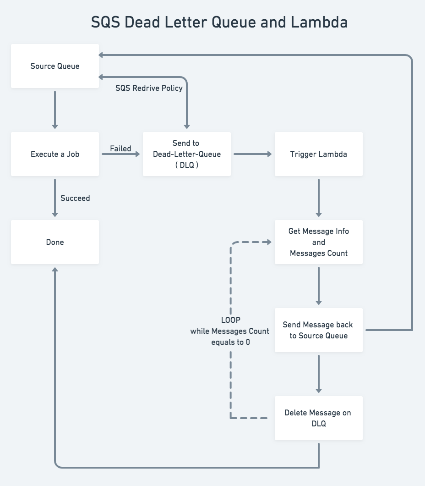

# aws_sqs-dead-letter-queue-lambda-requeue
Requeue Dead Letter Queue jobs Lambda and Terraform

### Environment
- Python 3.7
-  AWS SQS Source Queue
- AWS SQS DLQ Queue
- AWS Lambda as DLQ Handler


### Requirements
- boto3

```
pip3 install boto3

```


### SQS to Lambda Event
```json
{
    "Records": [
      {
        "messageId": "9cf06c9b-e919-4ef9-8485-3d13c347a4d1",
        "receiptHandle": "AQEBJRZxkQUWQYAwBMPpN4...rVCoU70HTdEVH4eKZXuPUVBw==",
        "body": "value0.6888803697786434",
        "attributes": {
          "ApproximateReceiveCount": "1",
          "SentTimestamp": "1530189332727",
          "SenderId": "AROAI62MWIO3S4UBJVPVG:sqs-flooder",
          "ApproximateFirstReceiveTimestamp": "1530189332728"
        },
        "messageAttributes": {},
        "md5OfBody": "7ce3453347fd9bd30281384c304a1f9d",
        "eventSource": "aws:sqs",
        "eventSourceARN": "arn:aws:sqs:us-east-1:XXXXXXXX:test-sqs-trigger-queue",
        "awsRegion": "us-east-1"
      }
    ]
  }

  ```


### Flow Chart

