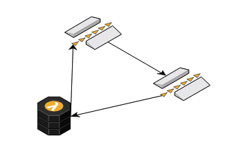
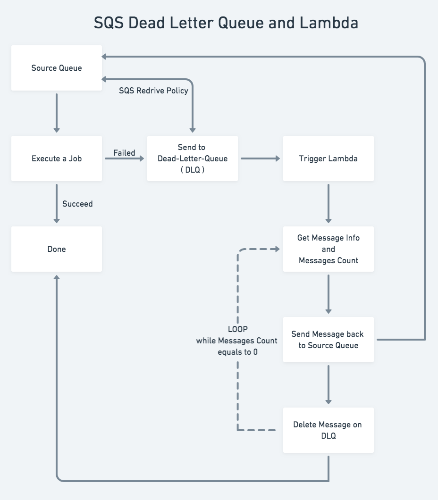

# aws_sqs-dead-letter-queue-lambda-requeue
Requeue Dead Letter Queue jobs Lambda and Terraform

<p align="center">
  
</p>


**IMPORTANT: Please Notice The Limit of Function** 

Loop will Break when Total Moved Job > 60 \
And Please Set a Timeout Value for your Lambda Function (300s is my value)

**WARNING:** It will be a Infinite Loop if you don't set


## Terraform

### Environment
- Terraform v0.11.13
- Terraform AWS Provider ~> 2.0


### Inputs

| Name | Description | Type | Default | Required |
|------|-------------|:----:|:-----:|:-----:|
| AWS\_ACCOUNT |  | string | `"00000000"` | yes |
| AWS\_REGION |  | string | `"us-east-1"` | yes |
| lambda\_deployment\_package | Lambda deployment package name | string | `"empty-deployment-package.zip"` | yes |
| lambda\_s3\_bucket\_name | For Put Lambda deployment package | string | `"default-bucket"` | yes |
| lambda\_stage |  | string | `"prod"` | yes |
| sqs\_name |  | string | `"default-queue"` | yes |


## Lambda

### Environment
- Python 3.7
-  AWS SQS Source Queue
- AWS SQS DLQ Queue
- AWS Lambda as DLQ Handler


### Requirements
- boto3
- logging

```
pip3 install boto3 logging
```

### Limit
- Total Moved Job > 60 
- Timeout = 300s

**This is important or it will be a Infinite Loop**


### SQS to Lambda Event
```json
{
    "Records": [
      {
        "messageId": "9cf06c9b-e919-4ef9-8485-3d13c347a4d1",
        "receiptHandle": "AQEBJRZxkQUWQYAwBMPpN4...rVCoU70HTdEVH4eKZXuPUVBw==",
        "body": "value0.6888803697786434",
        "attributes": {
          "ApproximateReceiveCount": "1",
          "SentTimestamp": "1530189332727",
          "SenderId": "AROAI62MWIO3S4UBJVPVG:sqs-flooder",
          "ApproximateFirstReceiveTimestamp": "1530189332728"
        },
        "messageAttributes": {},
        "md5OfBody": "7ce3453347fd9bd30281384c304a1f9d",
        "eventSource": "aws:sqs",
        "eventSourceARN": "arn:aws:sqs:us-east-1:XXXXXXXX:test-sqs-trigger-queue",
        "awsRegion": "us-east-1"
      }
    ]
  }

  ```


### Flow Chart

<p align="center">
  
</p>